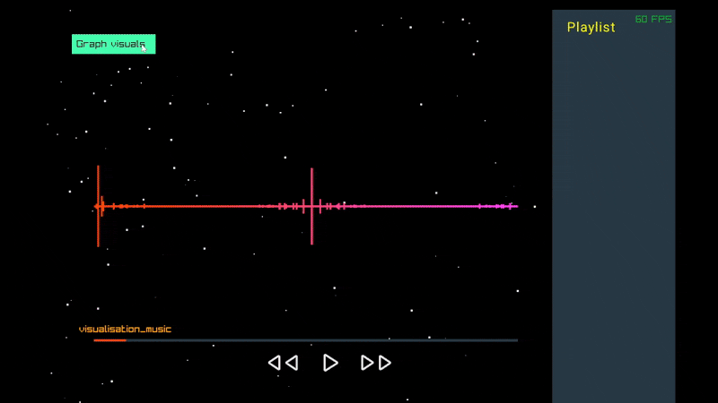

# C++ Music Visualizer (Raylib)

This is a simple music visualizer written in **C++**, using the **Raylib** graphics library.  
The project is still in early development (v1 not yet complete), and is currently paused indefinitely until I have more time to work on it.

Check the `dev branch` for the project files.

---

## Building & Running

Please follow the raylib build instructions for your particular platform. 
https://github.com/raysan5/raylib/wiki

This is how I'm building it for Windows: https://youtu.be/HPDLTQ4J_zQ?si=W6_tJ6jGkcKt5GkB

---

## Contributing

Development is currently paused, but feel free to fork the project or suggest ideas for future improvements!

---

Thanks for checking out the project! 🎵
